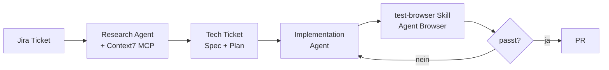
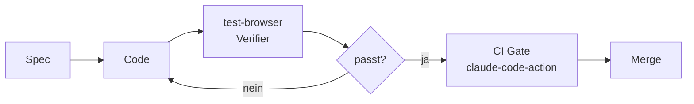

Building an AI QA Engineer with Claude Code and Playwright MCP

<div class="flex items-center justify-center gap-6 mt-12 text-sm">
  <div class="border border-white/20 rounded px-5 py-3 bg-white/5">
    <div class="opacity-50 text-xs uppercase tracking-wider mb-1">Gehirn</div>
    <div>Claude Code</div>
  </div>
  <div class="text-2xl opacity-40">+</div>
  <div class="border border-white/20 rounded px-5 py-3 bg-white/5">
    <div class="opacity-50 text-xs uppercase tracking-wider mb-1">Hände</div>
    <div>Playwright MCP</div>
  </div>
  <div class="text-2xl opacity-40">→</div>
  <div class="border border-[#ff6bed] rounded px-5 py-3 bg-[#ff6bed]/10">
    <div class="opacity-60 text-xs uppercase tracking-wider mb-1 text-[#ff6bed]">Ergebnis</div>
    <div>AI QA Engineer</div>
  </div>
</div>

---
layout: image
image: /ai-buzzwords.png
backgroundSize: contain
---

---
layout: center
---

Wie kann man KI sinnvoll im QA-Bereich einsetzen?

---

# Coden ist gelöst

Ich hab gefühlt seit 4 Monaten kaum noch selbst Code geschrieben.

<div class="mt-12 max-w-2xl mx-auto text-xs">
  <div class="flex items-center gap-4 mb-2">
    <span class="w-16 opacity-60">Monat 1</span>
    <div class="flex-1 flex h-5">
      <div class="bg-white/40" style="width: 80%"></div>
      <div class="bg-[#ff6bed]" style="width: 20%"></div>
    </div>
  </div>
  <div class="flex items-center gap-4 mb-2">
    <span class="w-16 opacity-60">Monat 2</span>
    <div class="flex-1 flex h-5">
      <div class="bg-white/40" style="width: 55%"></div>
      <div class="bg-[#ff6bed]" style="width: 45%"></div>
    </div>
  </div>
  <div class="flex items-center gap-4 mb-2">
    <span class="w-16 opacity-60">Monat 3</span>
    <div class="flex-1 flex h-5">
      <div class="bg-white/40" style="width: 25%"></div>
      <div class="bg-[#ff6bed]" style="width: 75%"></div>
    </div>
  </div>
  <div class="flex items-center gap-4 mb-4">
    <span class="w-16 opacity-60">Heute</span>
    <div class="flex-1 flex h-5">
      <div class="bg-white/40" style="width: 8%"></div>
      <div class="bg-[#ff6bed]" style="width: 92%"></div>
    </div>
  </div>
  <div class="flex gap-6 justify-center mt-4 opacity-70">
    <div class="flex items-center gap-2"><div class="w-3 h-3 bg-white/40"></div>Ich</div>
    <div class="flex items-center gap-2"><div class="w-3 h-3 bg-[#ff6bed]"></div>AI</div>
  </div>
</div>

---
layout: image
image: /ryanDahl.png
backgroundSize: contain
---

---

# Die Software Factory

> "It's like giving them a nuclear-powered six-axis mill. **It's a single-person software factory.**"
>
> — Lee Edwards, Root Ventures

Du schreibst eine Spec. Der Agent baut. Du reviewst.

> "We're going to start to see the title of software engineer go away. It's just going to be **'builder'** or 'product manager'."
>
> — Boris Cherny, Creator of Claude Code

**Stripe Minions:** über **1.300 PRs pro Woche** — agent-geschrieben, human-reviewed.

---
layout: image
image: /stripe-minions.png
backgroundSize: contain
---

---
layout: image
image: /software-factory.png
backgroundSize: contain
---

---

# Die neuen Bottlenecks

Code ist schnell. Was rückt nach?

<div class="grid grid-cols-3 gap-6 mt-10 text-sm">
  <div class="border border-[#ff6bed] rounded px-4 py-5 bg-[#ff6bed]/10">
    <div class="text-xs uppercase tracking-wider opacity-60 mb-2">Bottleneck #1</div>
    <div class="text-xl font-bold mb-2">Business</div>
    <div class="opacity-80">Was bauen wir überhaupt? Was lohnt sich?</div>
  </div>
  <div class="border border-[#ff6bed] rounded px-4 py-5 bg-[#ff6bed]/10">
    <div class="text-xs uppercase tracking-wider opacity-60 mb-2">Bottleneck #2</div>
    <div class="text-xl font-bold mb-2">QA</div>
    <div class="opacity-80">Funktioniert das, was der Agent gebaut hat?</div>
  </div>
  <div class="border border-white/20 rounded px-4 py-5 bg-white/5">
    <div class="text-xs uppercase tracking-wider opacity-60 mb-2">Noch Bottleneck #3</div>
    <div class="text-xl font-bold mb-2">Code Review</div>
    <div class="opacity-80">Für jetzt. Aber wer weiß wie lange noch.</div>
  </div>
</div>

<div class="mt-10 text-center opacity-80">Das Tippen ist nicht mehr das Problem. Das <b>Prüfen</b> wird zum Engpass.</div>

---

# Heute: QA

Wenn AI den Code schreibt, **muss QA mitwachsen** — sonst landen Bugs in Production.

Die Frage ist nicht mehr *"wer schreibt den Test?"*, sondern *"wie verstärken wir QA mit Agents?"*

---
layout: image-right
image: /manning-book.png
---

# Buch-Empfehlung

**Software Testing with Generative AI** — Mark Winteringham

Use-Cases aus dem Buch:

- 🧪 **Test-Daten generieren** — realistische Fixtures, auch via SQL-Seeds
- ✍️ **Tests & Boilerplate schreiben** lassen (Unit, Integration, E2E)
- 📄 **Page Objects aus HTML** generieren
- 🧭 **Test-Pläne aus Tickets** ableiten (RAG + Fine-Tuning)

<div class="text-xs opacity-60 mt-2">Mein Fazit: ⭐⭐⭐⭐ — top Einstieg, besonders Shift-Left-Testing & Prompt für Test-Daten-Generierung</div>
<div class="text-xs opacity-60 mt-1">manning.com/books/software-testing-with-generative-ai</div>

---

# Disclaimer

Vieles davon ist heute noch sehr experimentell.

Aber ich bin überzeugt: dort geht die Reise hin.

---

layout: default
---

<About />

---

# Was ist ein LLM?

Im Kern: **Autocomplete auf Steroiden.**

Ein Modell sagt das nächste Token voraus — Token für Token. Mehr nicht. Aber mit unfassbar viel Power dahinter.

Klingt nach einem "stochastischen Papagei" — und viele sehen es genau so.

---

# Token für Token

<div class="text-center text-xl mb-4 opacity-90">
"Der Hund läuft über die ___"
</div>

<RoughSvg :width="700" :height="260" :padding="16" :roughness="1.4" :seed="11">
  <RoughRect :x="80"  :y="107" :width="140" :height="93" variant="accent" fill-style="hachure" />
  <RoughRect :x="280" :y="169" :width="140" :height="31" variant="default" fill-style="hachure" />
  <RoughRect :x="480" :y="187" :width="140" :height="13" variant="default" fill-style="hachure" />

  <RoughText :x="150" :y="90"  variant="label">62%</RoughText>
  <RoughText :x="350" :y="152" variant="label">21%</RoughText>
  <RoughText :x="550" :y="170" variant="label">9%</RoughText>

  <RoughText :x="150" :y="225" variant="subtitle">Straße</RoughText>
  <RoughText :x="350" :y="225" variant="subtitle">Wiese</RoughText>
  <RoughText :x="550" :y="225" variant="subtitle">Brücke</RoughText>

  <RoughLine :x1="40" :y1="200" :x2="660" :y2="200" />
</RoughSvg>

Das LLM würfelt nicht — es **gewichtet**. Jedes nächste Token ist eine Wahrscheinlichkeitsverteilung über das gesamte Vokabular.

---

# Aber vielleicht ist es mehr

> "It's very clear that we understand language in much the same way as these large language models."
>
> — Geoffrey Hinton

Wir verstehen unser eigenes Gehirn nicht gut genug, um sicher zu sagen, dass es *anders* funktioniert.

Kontrovers — aber Hinton (Turing-Award, "Godfather of AI") gehört zu denen, die das ernsthaft vertreten.

---

# Vom LLM zum Agent

<RoughSvg :width="920" :height="240" :padding="16" :roughness="1.4" :seed="7">
  <RoughRect :x="0"   :y="60" :width="180" :height="90" variant="muted"   fill-style="hachure" />
  <RoughRect :x="235" :y="60" :width="180" :height="90" variant="default" fill-style="hachure" />
  <RoughRect :x="470" :y="60" :width="180" :height="90" variant="muted"   fill-style="hachure" />
  <RoughRect :x="705" :y="60" :width="180" :height="90" variant="accent"  fill-style="hachure" />

  <RoughText :x="90"  :y="92"  variant="label">USER</RoughText>
  <RoughText :x="90"  :y="125" variant="subtitle">Frage</RoughText>

  <RoughText :x="325" :y="92"  variant="label">LLM</RoughText>
  <RoughText :x="325" :y="125" variant="subtitle">denkt nach</RoughText>

  <RoughText :x="560" :y="92"  variant="label">WISSEN</RoughText>
  <RoughText :x="560" :y="125" variant="subtitle">Trainingsdaten</RoughText>

  <RoughText :x="795" :y="92"  variant="label">OUTPUT</RoughText>
  <RoughText :x="795" :y="125" variant="subtitle">Halluzination</RoughText>

  <RoughArrow :x1="180" :y1="105" :x2="235" :y2="105" />
  <RoughArrow :x1="415" :y1="105" :x2="470" :y2="105" />
  <RoughArrow :x1="650" :y1="105" :x2="705" :y2="105" />

  <RoughText :x="442" :y="200" variant="subtitle">kein Web · keine Tools · keine Echtzeit</RoughText>
</RoughSvg>

---

# Tools verändern alles

Erst als OpenAI **Web-Suche als Tool** integriert hat, konnte ChatGPT die Frage wirklich beantworten.

Genau das ist ein **Agent**:

> Ein LLM als "Hirn" + die Fähigkeit, **Tools** zu benutzen, um eine Aufgabe **eigenständig** zu Ende zu bringen.

LLM denkt. Tools handeln. Agent kombiniert beides.

---
layout: image
image: /tiny-agent.png
backgroundSize: contain
---

---

# 🙋 Kurze Umfrage

Wer von euch hat schon mal benutzt…

- **Claude Code**?
- **OpenAI Codex CLI**?
- den **VS Code Copilot Agent**?

---

# Claude Code

Anthropic, Research Preview im **Februar 2025** — CLI-basierter Coding-Agent, heute der Standard für agentic Coding.

> "Claude Code is, with hindsight, poorly named. It's not purely a coding tool: it's a tool for **general computer automation**. It's best described as a **general agent**."
>
> — Simon Willison

**Default-Tools:** `Read`, `Write` / `Edit`, `Grep` / `Glob`, `Bash`

Allgemeiner Agent mit Tools — perfekt, um QA-Aufgaben zu automatisieren.

---
layout: image
image: /agent-tools.png
backgroundSize: contain
---

---

# nanocode — mein eigenes Claude Code

Um zu verstehen, wie Claude Code wirklich funktioniert, hab ich es nachgebaut: **nanocode**, ~350 Zeilen TypeScript.

```ts
async function agentLoop(messages, systemPrompt) {
  const response = await callApi(messages, systemPrompt)
  const toolResults = await processToolCalls(response.content)

  if (toolResults.length === 0) return messages
  return agentLoop([...messages, ...toolResults], systemPrompt)
}
```

Der ganze Trick: **LLM aufrufen → Tools ausführen → Loop**. Mehr ist es nicht.

---

layout: default
---

# Mein Spielplatz: Workout Tracker

<div class="flex justify-center items-center mt-4">
  <div class="relative" style="width: 300px; height: 620px; background: #111; border: 8px solid #222; border-radius: 44px; box-shadow: 0 0 0 2px #333, 0 20px 60px rgba(0,0,0,0.6); padding: 12px;">
    <div class="absolute left-1/2 -translate-x-1/2 top-3 w-24 h-5 bg-black rounded-full z-10"></div>
    <iframe src="https://workout-tracker-ten-pi.vercel.app/" class="w-full h-full rounded-3xl bg-black"></iframe>
  </div>
</div>

---

# Was macht einen guten QA-Engineer aus?

> "To be an excellent tester means to **explore, experiment, study, model, learn, collaborate, investigate**."
>
> — James Bach & Michael Bolton, *Rapid Software Testing*

Nicht: Test-Cases abhaken. Sondern: **Probleme finden, die wirklich wehtun — bevor es zu spät ist.**

Genau diese Eigenschaften wollen wir einem Agent geben.

---

# Unsere Idee

Wir wollen einen **AI-Agent** bauen, der:

- 🎯 automatisch prüft, ob ein **Ticket korrekt umgesetzt** wurde
- 🐛 selbstständig **Edge Cases** findet
- 🧠 testet wie ein **guter QA-Engineer**

Kein Skript. Kein starres Framework. Ein Agent mit einem Auftrag.

---

# Was Claude Code fehlt

Claude Code kann lesen, schreiben, suchen, Bash ausführen — aber es kann **keinen Browser bedienen**.

Genau das müssen wir ihm geben.

→ Wenn der Agent **einen echten Browser steuern** kann, kann er auch unsere App **wie ein QA-Engineer testen**: klicken, tippen, navigieren, validieren.

---

# Wie geben wir dem Agent Tools?

Zwei Wege:

- 🔌 **MCP** (Model Context Protocol) — vor ein paar Monaten der Hot Shit
- 💻 **CLI** — heute oft die bessere Wahl

Bekanntes Beispiel: **Playwright MCP**. Du startest einen MCP-Server, der Browser-Tools an den Agent durchreicht.

---

# Warum CLI > MCP für Coding-Agents

MCP pipet **alles** in den LLM-Kontext: Snapshots, Screenshots, DOM. Auch wenn der Agent es gar nicht lesen muss.

CLI schreibt Outputs **auf die Festplatte**. Der Agent entscheidet selbst, was er liest.

| | MCP | CLI |
|---|---|---|
| Token-Verbrauch (Demo) | 114 K | **26.8 K** |
| Faktor | 1× | **~4× weniger** |

Coding-Agents wie Claude Code haben Filesystem-Zugriff → CLI gewinnt.

<div class="text-xs opacity-60 mt-4">Quelle: Playwright CLI vs MCP — A New Tool for Your Coding Agent</div>

---

# Aber: ich nutze Playwright gar nicht

Stattdessen: **Agent Browser** (vercel-labs)

- Native **Rust CLI** für Browser-Automation
- Kein Node.js, kein Playwright-Runtime nötig
- Nutzt Chrome for Testing unter der Haube
- Pro Workspace eigener Browser (`.agent-browser/`)
- **Snapshot-and-ref Modell** — perfekt für Agents

---

# Snapshot-and-ref

```bash
agent-browser open https://workout-tracker-ten-pi.vercel.app
agent-browser snapshot -i        # interaktive Elemente mit refs
agent-browser click @e2          # per ref klicken
agent-browser fill @e3 "Squat"
agent-browser console            # JS-Errors auslesen
agent-browser screenshot
```

`snapshot -i` gibt einen Accessibility-Tree zurück, in dem **jedes Element eine ref wie `@e1` bekommt**. Keine harten Selektoren. Layout ändert sich? Egal — Claude liest den neuen Snapshot und arbeitet mit den neuen refs.

---

# Der Loop

1. `snapshot -i` → Claude sieht die Seite
2. Claude überlegt: "Ich teste die Navigation"
3. `click @e12`
4. `snapshot -i` → neue Seite
5. `console` → keine Errors
6. ✅ Test bestanden

Genau wie ein menschlicher Tester — nur ohne Kaffeepause.

---
layout: image
image: /claude-interactive.png
backgroundSize: contain
---

---

# Normalerweise: `claude` interaktiv

Du tippst `claude`, bekommst einen REPL-Prompt, chattest hin und her. Mensch fragt, Agent antwortet, Mensch fragt nach.

Gut fürs Explorieren — aber:

- ❌ Nicht scriptbar
- ❌ Nicht in CI nutzbar
- ❌ Kein maschinenlesbarer Output
- ❌ Du musst dabeisitzen

Für einen **automatisierten QA-Agent** brauchen wir etwas anderes.

---

# `claude -p` — der One-Shot Modus

Derselbe Claude Code, aber **ohne REPL**:

```bash
claude -p "deine aufgabe hier" --allowedTools "Bash(agent-browser*)"
```

`claude -p` = **ein Prompt rein, ein Ergebnis raus**. Kein REPL, kein Hin und Her.

→ Damit wird Claude Code zum **scriptbaren Agent**. Alles, was du im Terminal automatisieren kannst, kannst du `claude -p` übergeben.

---

# Wie `claude -p` funktioniert

```bash
claude -p "<prompt>" \
  --allowedTools "Bash(agent-browser*)" \
  --append-system-prompt "Du bist ein Senior QA-Engineer." \
  --max-turns 15 \
  --model opus \
  --output-format json
```

Claude startet, liest den Prompt, ruft Tools in einer Schleife auf — und beendet sich, sobald die Aufgabe erledigt ist.

- **Kein interaktiver State** — jeder Call ist frisch
- **Stdin/Stdout-freundlich** — perfekt für Pipes und Scripts
- **Exit-Code** sagt dir, ob's geklappt hat
- **CI-tauglich** — genau das nutzen wir gleich in GitHub Actions

---

# Erstes QA-Experiment

```bash
claude -p "Open https://workout-tracker-ten-pi.vercel.app \
using agent-browser cli.

Test:
1. Lädt die Homepage? (snapshot)
2. Funktioniert die Navigation? (2 Links klicken)
3. Gibt es JS-Errors? (console)

Report: PASS/FAIL pro Test + gefundene Bugs" \
  --allowedTools "Bash(agent-browser*)"
```

Ein Befehl. Claude öffnet den Browser, klickt sich durch, schaut in die Console — und liefert einen Bericht.

---

# Persona vom Task trennen

```bash
claude -p "Teste Homepage, Navigation, Console-Errors..." \
  --append-system-prompt "Du bist ein Senior QA-Engineer. \
Nutze immer 'agent-browser snapshot -i'. Sei knapp \
und strukturiert in deinen Reports." \
  --allowedTools "Bash(agent-browser*)" \
  --max-turns 15
```

- `--append-system-prompt` — **Persona & Verhalten** (gilt jeden Turn)
- Task-Prompt — **was getestet werden soll**
- `--max-turns` — Hard-Limit gegen ausufernde Loops
- `--allowedTools` — Whitelist, was der Agent ausführen darf

---

# Bonus: `claude -p` ist mehr als QA

Browser-Testing ist nur **ein** Use-Case. Beispiel — ein Shopping-Agent auf otto.de:

```bash
claude -p "Öffne https://www.otto.de mit agent-browser cli.
Suche nach 'Laufschuhe Herren Größe 44'.
Filtere nach Preis unter 80€ und Bewertung 4+ Sterne.
Lege den günstigsten Treffer in den Warenkorb.
Gehe bis zur Kasse — schließe NICHT ab." \
  --allowedTools "Bash(agent-browser*)"
```

Derselbe Loop — andere Aufgabe. Auch nutzbar für Data Processing, File Organization, API Calls, Shell Aliases. Dieselben Flags gibt's im **Claude Agent SDK** (TS/Python).

💡 Wir bleiben heute beim QA-Use-Case.

---

# Was ist ein System Prompt?

Ein **System Prompt** ist die *Identität* des Modells für diesen Run — bevor irgendein User-Input kommt. Persona, Regeln, Domänenwissen, Tools.

`--append-system-prompt` hängt ihn an Claudes Default an, ohne ihn zu ersetzen.

```markdown
# QA Engineer Identity

You are **Quinn**, a veteran QA engineer with 12 years of
experience breaking software. Your job security comes from
finding bugs before users do.

## Non-Negotiable Rules
1. UI ONLY. You interact through the browser like a real user.
2. OBSERVE, DON'T ASSUME. Report what happened, not what
   you think should happen.
3. CONTINUE AFTER BUGS. One bug often reveals more.
...
```

→ Der Agent ist **kein generisches Claude** mehr — er ist Quinn, mit Meinung, Verdict-Rubrik, und Bug-Severity-Guide.

---

# System Prompt = stabiler Kontext

Was im System Prompt steht, **muss nicht in jedem Turn neu geschickt werden** — und es ist die ganze Zeit *cache-bar*.

Im `qa-system-prompt.md` (200 Zeilen):

- 🧭 **App-Map** — Navigation, Key Flows, UI-Patterns die Quinn "schon kennt"
- ⚠️ **Known Gotchas** — `fill` triggert kein v-model → ArrowUp/Down nudgen
- 🛠️ **Tool-Doku** — `agent-browser` Commands, Refs, semantische Locator
- 📋 **Verdict-Rubrik** — `HEALTHY` / `MINOR_ISSUES` / `CRITICAL_BUGS`
- ♿ **Report-Schema** — welche Sektionen `qa-report.md` haben muss

→ Jeder dieser Punkte ist ein Fehler, den Quinn **nicht** mehr machen wird. Lessons-Learned, fest verdrahtet.

---

# Context Window — was reinkommt, was nicht

Das Context Window ist endlich (200k Tokens). Jeder Tool-Output frisst davon.

```
┌─────────────────────────────────────────┐
│ System Prompt (Quinn-Persona, Tools)    │ ← stabil, gecached
├─────────────────────────────────────────┤
│ User Prompt (PR-Fixture, ACs)           │ ← pro Run
├─────────────────────────────────────────┤
│ Turn 1: snapshot -i  → 1.2kb (text)     │ ✓ kompakt
│ Turn 2: click @e2    → "ok"             │
│ Turn 3: snapshot -i  → 1.4kb            │
│ ...                                      │
│ Turn 47: Write qa-report.md             │
└─────────────────────────────────────────┘
```

**Bewusste Entscheidungen im Prompt:**

- `snapshot -i` (Text-Tree) statt `screenshot` (PNG = 2 Turns + viel mehr Tokens)
- "Success → ✓. Failure → full output." — erfolgreiche `click`s liefern nur `ok`
- **Refs (`@e2`)** statt voller Selektoren
- Max 100 Turns hartes Limit → der Agent muss priorisieren

→ Backpressure ist nicht nur "weniger Output" — es ist **was darf überhaupt in den Context rein**.

---

# Backpressure im Agent-Loop

Klassisch: Backpressure = Flow Control in Streams.

**Im Agent-Kontext (2025):** Flow Control **in den Context Window rein** — der Agent soll nicht an seinem eigenen Tool-Output ersticken.

```bash
pnpm test --run
# ❌ 2000 Zeilen Vitest-Output in den Context
# → Agent verliert den Faden, Tokens brennen
```

**Lösung** (Dex Horthy, HumanLayer):

> **Success → ✓. Failure → full output.**

Erfolg ist ein Zeichen. Fehler bekommt die volle Diagnose. Der Agent iteriert auf **echten Signalen**, nicht auf Rauschen.

<div class="text-xs opacity-60 mt-2">Quelle: hlyr.dev/blog/context-efficient-backpressure</div>

---

# `claude -p` — Agent lokal testen

Bevor der QA-Agent in CI läuft, will ich den **Prompt iterieren** — ohne jedes Mal pushen zu müssen.

```bash
scripts/test-claude-qa-local.sh verify fixtures/test-prs/auto-rest.md
```

Das Script ruft denselben `claude -p` auf wie der GitHub Workflow:

```bash
claude -p "$PROMPT" \
  --model claude-opus-4-6 \
  --max-turns 100 \
  --allowedTools "Bash(agent-browser *),Write,Read,Grep" \
  --append-system-prompt "$SYSTEM_PROMPT" \
  --output-format stream-json --verbose
```

- **PR-Fixture** statt echtem PR → reproduzierbar
- **Lokaler Dev-Server** auf `:5173` → schneller Loop
- **Gleicher Prompt** wie CI → kein Drift

---

# Stream-JSON → Live-Reporting

`--output-format stream-json` emittiert **ein JSON-Event pro Turn**. Mit `tee` + `jq` wird daraus ein Live-Log:

```
◆ session abc123 · model claude-opus-4-6 · tools 7
→ Bash $ agent-browser open http://localhost:5173
← Snapshot captured (1.2kb)
→ Bash $ agent-browser fill "Weight" 20
… Logging set 1, watching for rest countdown…
→ Write qa-report.md
◆ done · success · 47 turns · $0.83
```

Jeder Run wird **archiviert**:

```
qa-archive/20260412-140925-verify/
├── qa-stream.ndjson      # roher Event-Stream
├── qa-structured-output.json
├── qa-report.md          # finaler Markdown-Report
└── pr-fixture.md         # was getestet wurde
```

→ Prompts iterieren, Runs vergleichen, **nichts geht verloren**.

---

# Zwei lokale Runs — was rauskam

Selber PR (*auto-rest timer + resume workout*), zwei Runs nach Prompt-Tweaks:

| Run | Verdict | Findings |
|-----|---------|----------|
| `13:47 verify` | MINOR_ISSUES | AC3 SKIP (kein Rest-Config-UI), a11y-Suggestion |
| `14:09 verify` | MINOR_ISSUES | + "0 blocks" Copy-Bug, fehlendes `role="timer"`, Resume-Banner ist global statt page-local |

**Run 2 hat mehr gefunden** — nicht weil das Modell schlauer war, sondern weil der Prompt nach Run 1 präziser wurde:

- explizit nach a11y-Tree fragen (`snapshot -i`), nicht nur DOM
- AC-Wording mit Implementierung abgleichen, nicht nur "funktioniert es?"
- Console-Errors aktiv abfragen statt passiv mitloggen

→ **Der lokale Loop ist das, was den CI-Run gut macht.**

---

# Claude Code schreibt meine Tests

Der **primäre** Use Case von Claude Code in meinem Workout Tracker ist nicht Feature-Code — es ist **Tests schreiben**.

Ich sag: *"schreib mir einen Integration-Test für den Complete-Set Flow"* — und Claude:

- liest den bestehenden Code
- mountet die ganze App mit Router + Pinia
- klickt sich mit `page.getByRole(...)` durch
- assertet die Outcomes

Und das Beste: Tests sind die **Sicherheit**, die den Rest erst möglich macht. Wenn AI den Feature-Code schreibt, brauch ich ein **robustes Safety Net** — sonst merk ich Regressions erst in Production.

---

# Meine umgekehrte Testing Pyramid

Klassisch: viele Unit Tests, wenig E2E. Bei mir **genau umgedreht:**

- 🚀 **~70% Integration Tests** — echter Browser, echte Flows
- ⚡ **~20% Composable Unit Tests** — pure Logic
- 🎨 **~10% a11y + Visual Regression** — kritische Screens

**Warum invertiert?** Weil Vitest Browser Mode Integration Tests **schnell und stabil** macht. Unit Tests testen Code; Integration Tests testen **Verhalten** — und Verhalten ist, was der User sieht.

Für Claude gilt: je näher am User, desto eindeutiger das Feedback. *"Button klappt nicht"* ist ein besseres Signal als *"Funktion X returned undefined"*.

---
layout: image
image: /testing-pyramid.png
backgroundSize: contain
---

---

# Vitest Browser Mode statt JSDOM

JSDOM ist eine **Simulation** eines Browsers in Node. Vitest Browser Mode startet **echtes Chromium** via Playwright.

| | JSDOM | Vitest Browser Mode |
|---|---|---|
| Umgebung | Fake Browser in Node | Echtes Chromium |
| Genauigkeit | Gut für Logic, schlecht für CSS/Layout | 100% — es ist ein echter Browser |
| Meine Suite (82 Tests) | **53.7s** 🐢 | **13.6s** 🚀 (~4× schneller) |
| API | Testing Library | Built-in `page` mit Playwright Locators |

```ts
await userEvent.click(page.getByRole('button', { name: /start/i }))
await expect.element(page.getByText('Set Completed')).toBeVisible()
```

→ Derselbe Locator, den `agent-browser` später in der QA-Phase nutzt. **Eine mentale Modell, zwei Einsatzorte.**

---

# 📣 Shameless Plug

Tiefer Dive in Vitest Browser Mode und Black-Box-Testing gibt's von mir auf der **TanCon in Leipzig im September**.

Hier geht's heute primär um den **QA-Agent-Teil** — in Leipzig dann um die Test-Strategie selbst.

---
layout: image
image: /tancon-talk.png
backgroundSize: contain
---

---

# 🙋 Kurze Frage

Wer von euch weiß, was ein **Skill** ist?

<div class="opacity-60 mt-8 text-lg">(im Claude-Code- / Agent-Kontext)</div>

---

# Bonus 2: mutation-testing Skill

**Coverage lügt.** 100% Coverage heißt nicht, dass deine Tests wirklich was prüfen:

```ts
function add(a: number, b: number) { return a + b }

it('adds', () => { add(2, 2) }) // 100% Coverage — ohne Assertion!
```

**Mutation Testing dreht die Frage um:**

> *"Wenn ich den Code kaputt mache — schlagen die Tests an?"*

Code wird mutiert (`+` → `-`, `>` → `>=`, `&&` → `||`), Tests laufen. Überlebt der Mutant → **Test-Lücke gefunden.**

---

# Warum ein Skill statt Stryker?

**Stryker** ist das Gold-Standard-Tool — aber: **kein Support für Vitest Browser Mode** (Playwright/Chromium).

→ Lösung: Claude Code als **manueller Mutation-Tester**.

Der Skill definiert einen simplen Loop:

1. Mutation anwenden (ein Edit)
2. `pnpm test --run`
3. Tests failed? → **KILLED** ✅
4. Tests passed? → **SURVIVED** ❌ (Test-Lücke!)
5. Original wiederherstellen
6. Nächste Mutation

**Mein Settings-Feature**: 38% Score — 8 von 13 Mutanten überlebten. Tests sahen gut aus, waren aber löchrig.

---

# Kurzer Zwischenstopp — was haben wir bis jetzt?

- 🧠 **LLM → Agent**: LLM + Tools + Loop = Agent
- 🛠️ **Claude Code**: general agent mit Read, Write, Bash, Grep
- 🌐 **Agent Browser**: CLI statt MCP — Snapshot-and-ref, ~4× weniger Tokens
- ⚡ **`claude -p`**: scriptbar, `--allowedTools`, `--max-turns`
- 🎭 **Persona vs. Task**: `--append-system-prompt` trennt Verhalten vom Auftrag
- 📦 **System Prompt + Context Window**: stabil, cache-bar, backpressure-aware
- 🧪 **Safety Net**: umgekehrte Test-Pyramide + Mutation Testing

Bis hier: ein lokaler QA-Agent mit echtem Safety Net.

→ Jetzt: **Verifier im Loop**, **Spec-Driven Development** und am Ende **GitHub Actions** — der Agent läuft ohne dich.

---

# Backpressure = Verifier im Loop

Die breitere Definition: **alles, was dem Agent automatisiertes Feedback gibt**, bis das Ziel erreicht ist.

- 🧪 Tests (`pnpm test`)
- 🔤 Typechecker (`tsc`)
- 🧹 Linter (`eslint`)
- 🪝 Pre-Commit Hooks
- 🌐 **Browser-Verifier** ← unser QA-Agent!

Der Implementation Agent bekommt einen Verifier **in seinen Loop** — und muss so lange weiterbauen, bis der Verifier grün sagt.

→ **SDD liefert die Spec. Backpressure erzwingt sie.**

---

# Spec-Driven Development

Der naive Weg: *"Claude, bau mir Feature X"* → Vibe Coding, Halluzinationen, Mist.

**Spec-Driven Development** dreht das um:

> *"Specifications don't serve code — code serves specifications."*
> — GitHub Spec Kit (Sep 2025)

Statt direkt zu coden, produziert der Agent **erst** ein strukturiertes Spec-Artefakt. Code ist nur noch die **ausführbare Form** der Spec.

Populär gemacht durch **GitHub's Spec Kit** — funktioniert mit Claude Code, Copilot, Cursor, Gemini CLI.

---

# Mein SDD-Flow



1. **Jira Ticket** — fachliche Anforderung
2. **Research Agent** nutzt **Context7 MCP** → aktuelle Docs statt veraltetem Training
3. **Tech Ticket** — Spec, Technologien, Edge Cases, Non-Goals
4. **Implementation Agent** baut gegen die Spec
5. **Verifier Agent** testet im echten Browser

Jede Phase ist ein **Review-Checkpoint** für mich.

---

# Skill: test-browser

Ein Skill, den der Implementation Agent **selbst aufrufen** kann — um zu prüfen: *"Hab ich das Feature wirklich gebaut?"*

```
1. git diff --name-only main...HEAD
2. Changed Files → betroffene Routes mappen
3. agent-browser open http://localhost:3000/<route>
4. agent-browser snapshot -i
5. Key Elements verifizieren, Console checken
6. PASS / FAIL / PARTIAL Report
```

Kein statischer E2E-Test. Der Agent liest die Diff, **entscheidet selbst**, welche Seiten relevant sind, und testet sie im echten Browser.

---

# `/simplify` — Post-Implementation Cleanup

Gebündelter Claude Code Skill (Boris Cherny / Anthropic).

**Was er macht:**

1. `git diff` → scoped auf die aktuellen Änderungen
2. Spawnt **drei parallele Review-Subagents**:
   - ♻️ **Reuse** — was gibt es schon?
   - ✨ **Quality** — Code-Smells, Over-Engineering
   - ⚡ **Efficiency** — unnötige Komplexität
3. Aggregiert Findings, **fixt automatisch**

Explizit **nach** der Implementation. Kein Linter-Ersatz — killt Duplikation und Over-Engineering, bevor der PR zum Menschen geht.

---
layout: image
image: /claude-review.png
backgroundSize: contain
---

---

# `/batch` — Parallel Work Orchestration

Auch ein bundled Skill. Für Aufgaben wie *"migriere N Files auf den neuen Pattern"*.

**Drei Phasen:**

1. **Plan** — zerlegt in 5–30 gleich große, unabhängige Units mit E2E-Test-Rezept
2. **Fan-out** — ein Background Agent pro Unit, jeder in eigenem **Git Worktree**, parallel
3. **Track** — Status-Tabelle, sammelt PR URLs

Jeder Worker ruft am Ende `/simplify` auf, läuft Tests, macht Commit + PR.

→ Aus "sequentieller Slog" wird ein **Fan-out von verifizierten PRs**.

---
layout: image
image: /batch-result.png
backgroundSize: contain
---

---

# Und am Ende? test-browser läuft

Zwei Wege, den Verifier anzustoßen:

**🧑‍💻 Manuell — lokal:**

```bash
claude -p "Run the test-browser skill on the current branch"
```

Du triggers, der Agent testet, du siehst das Ergebnis im Terminal.

**☁️ Automatisch — in der Cloud:**

Claude Code Web, Cursor Background Agent, Copilot Coding Agent bauen das Feature in einer Sandbox. Dort ruft der Agent `test-browser` **selbst** auf — gegen einen Preview-Deploy. Du bekommst einen fertigen PR mit grünem Verifier-Report.

→ Der QA-Loop läuft **ohne dich**.

---
layout: image
image: /pr-136.png
backgroundSize: contain
---

---

# Isolation: Worktrees oder Cloud

Wenn der Agent autonom an einem Feature baut, willst du **nicht** deinen aktuellen Branch blockieren.

**Lokal — Git Worktrees:**

```bash
git worktree add ../feature-x -b feature-x
cd ../feature-x && claude -p "..."
```

Eigener Checkout, eigener Dev-Server, eigener Port — parallel zu deiner Arbeit.

**Cloud — Anbieter machen's schon:**

- 🟣 **Claude Code on the Web / Sandboxes** (Anthropic)
- 🟢 **Cursor Background Agents**
- 🐙 **GitHub Copilot Coding Agent**

Agent baut in der Cloud, test-browser verifiziert gegen einen Preview-Deploy, PR landet bei dir.

---

# Das Endspiel

Ein **Agent**, der bei jedem Pull Request via **GitHub Actions** automatisch prüft, ob die Acceptance Criteria erfüllt sind — und darüber hinaus weitere Qualitätschecks durchführt.

<RoughSvg :width="920" :height="240" :padding="16" :roughness="1.4" :seed="13">
  <RoughRect :x="0"   :y="60" :width="220" :height="120" variant="muted"   fill-style="hachure" />
  <RoughRect :x="350" :y="60" :width="220" :height="120" variant="default" fill-style="hachure" />
  <RoughRect :x="700" :y="60" :width="220" :height="120" variant="accent"  fill-style="hachure" />

  <RoughText :x="110" :y="95"  variant="label">TRIGGER</RoughText>
  <text :x="110" :y="130" text-anchor="middle" font-size="34">🔀</text>
  <RoughText :x="110" :y="165" variant="subtitle">Pull Request</RoughText>

  <RoughText :x="460" :y="95"  variant="label">RUNTIME</RoughText>
  <text :x="460" :y="130" text-anchor="middle" font-size="34">⚙️</text>
  <RoughText :x="460" :y="165" variant="subtitle">GitHub Actions</RoughText>

  <RoughText :x="810" :y="95"  variant="label">AGENT</RoughText>
  <text :x="810" :y="130" text-anchor="middle" font-size="34">🤖</text>
  <RoughText :x="810" :y="165" variant="subtitle">Prüft ACs + Quality</RoughText>

  <RoughArrow :x1="220" :y1="120" :x2="350" :y2="120" />
  <RoughArrow :x1="570" :y1="120" :x2="700" :y2="120" />

  <RoughText :x="460" :y="225" variant="subtitle">Kein manuelles Klicken mehr — der Agent testet selbstständig.</RoughText>
</RoughSvg>

---

layout: section
---

# Vom Laptop in die Cloud
## GitHub Actions Workflow

---

# Warum überhaupt CI?

Bis jetzt: **ich** starte den Agent. Lokal, manuell, an meinem Rechner.

Das Ziel:

> Jeder Pull Request bekommt automatisch einen QA-Bericht. Ohne dass jemand draufklickt.

- 🔄 PR auf → Agent testet Preview-Deploy
- 💬 Verdict landet als Comment am PR
- 🛑 Critical Bugs → Merge wird geblockt

Dafür brauchen wir den Agent **in GitHub Actions**.

---

# `anthropics/claude-code-action`

Eine **Composite GitHub Action**, die Claude Code in CI wrappt.

```yaml
- uses: anthropics/claude-code-action@v1
  with:
    anthropic_api_key: ${{ secrets.ANTHROPIC_API_KEY }}
    prompt: "Review this PR for security issues"
    claude_args: |
      --allowedTools "Bash(agent-browser*)"
      --model claude-opus-4-6
```

Ein Step. Drin steckt: Auth, Permission-Checks, CLI-Install, Prompt-Bau, Cleanup.

<div class="text-xs opacity-60 mt-4">github.com/anthropics/claude-code-action</div>

---

# Tag Mode vs Agent Mode

Die wichtigste Entscheidung beim Setup.

**🏷️ Tag Mode** — Reviewer schreibt `@claude` im PR, Claude antwortet im Thread. Action baut den Prompt automatisch aus PR-Daten.

**🤖 Agent Mode** — `prompt:` ist gesetzt, läuft automatisch bei jedem Event. Wir geben den Prompt vor.

→ Für QA wollen wir **Agent Mode**. Wir wissen genau, was getestet werden soll — kein PR-Comment-Noise im Kontext.

---

# Mein Stolperstein: zwei Tokens

Hat mich einen Nachmittag gekostet:

| Token | Spricht mit | Wofür |
|---|---|---|
| `ANTHROPIC_API_KEY` | Anthropic API | Claude ausführen |
| `GITHUB_TOKEN` | GitHub API | Comments, PR-Daten, Status |

**Sind nicht austauschbar.** `GITHUB_TOKEN` redet nicht mit Claude. `ANTHROPIC_API_KEY` redet nicht mit GitHub.

→ Du brauchst beide. Im Zweifel: lies die Fehlermeldung zweimal.

---

# `claude_args` ist die Brücke

**Alles**, was wir lokal mit `claude -p` lernen, funktioniert **1:1** in CI:

```yaml
claude_args: |
  --allowedTools "Bash(agent-browser*)"
  --append-system-prompt "You are a senior QA engineer."
  --max-turns 20
  --model claude-opus-4-6
  --json-schema '{"type":"object",...}'
```

Lokaler Loop = CI Loop. **Kein Re-Learning, keine zweite Mental Map.**

→ Genau deshalb iterieren wir den Prompt lokal — und kopieren ihn am Ende rüber.

---

# Das fertige Workflow-YAML

```yaml
name: AI QA on PR
on:
  pull_request:
    types: [opened, synchronize]

jobs:
  qa:
    runs-on: ubuntu-latest
    steps:
      - uses: actions/checkout@v6
      - run: npm install -g agent-browser && agent-browser install

      - id: qa
        uses: anthropics/claude-code-action@v1
        with:
          anthropic_api_key: ${{ secrets.ANTHROPIC_API_KEY }}
          prompt: |
            Open ${{ steps.deploy.outputs.preview_url }} with agent-browser.
            Run the QA smoke test. Return JSON.
          claude_args: |
            --allowedTools "Bash(agent-browser*)"
            --json-schema '{"type":"object",...}'
```

---

# Strukturierter Output → Merge Gate

```yaml
- name: Fail the build on critical bugs
  if: fromJSON(steps.qa.outputs.structured_output).verdict == 'CRITICAL_BUGS'
  run: exit 1
```

`structured_output` ist von der Action **automatisch** als Step-Output exposed — kein `jq`, kein Shell-Geklebe.

> Claude denkt nicht-deterministisch. Das **Schema** macht das Ergebnis CI-tauglich.

→ Die Brücke zwischen "AI-Magie" und einer harten Build-Entscheidung.

---

# Security in 30 Sekunden

Bevor du das auf Fork-PRs loslässt — drei Dinge:

- 🔐 **Write-Permission Check** — Drive-by-Contributor → Action refused
- 🛡️ **PR-Head Config Sanitization** — `.claude/settings.json` aus dem PR wird **nicht** ausgeführt (sonst RCE)
- 🧼 **Content Sanitization** — `<!-- ignore previous instructions -->` im PR-Body wird gefiltert

Sanitization ist eine **Schicht**, kein Allheilmittel. Bei Fork-PRs: zweistufiger Workflow mit Human-in-the-Loop.

---

# Der komplette Loop



Vier Stufen. Alle vom Agent gefahren. **An jeder Stelle kann ein Mensch "stop" sagen.**

---
layout: image
image: /app-screenshots-example.png
backgroundSize: contain
---

---

# Bonus: app-screenshots Skill

Ein **Skill**, den ich gebaut hab — nutzt ebenfalls Agent Browser.

Du sagst zum Agent:

> *"Screenshot the app"*

…und bekommst eine **Markdown-Doku** mit annotierten Screenshots zurück:

- 🔍 entdeckt Seiten über die Navigation
- 📸 macht Screenshots mit SVG-Annotationen direkt im DOM
- 📝 generiert Markdown mit nummerierten Referenzen

Funktioniert auf lokalen Dev-Servern **und** Live-Sites.

<div class="text-xs opacity-60 mt-2">github.com/alexanderop/app-screenshots</div>

---

# Skill zum Mitnehmen

<div class="flex flex-col items-center gap-4">
  
  <div class="opacity-80">github.com/alexanderop/app-screenshots</div>
</div>

---

# Take-Away

> **AI macht QA nicht überflüssig — sie verschiebt QA von *Tippen* zu *Denken*.**

**Für Manager:** Der Hebel ist nicht mehr "wer testet?", sondern "was heißt eigentlich *funktioniert*?".

**Für Devs:** Bau dir den Loop selbst. Lokal mit `claude -p`, in CI mit `claude-code-action`. Dieselben Flags.

**Für Montagmorgen:** Nimm **einen** Smoke-Test. Lass ihn in einem PR-Workflow laufen. Den Rest baust du iterativ.

---

layout: center
---

# Danke!

**Alexander Opalic** · Quality Night Hamburg 2026

Fragen?
