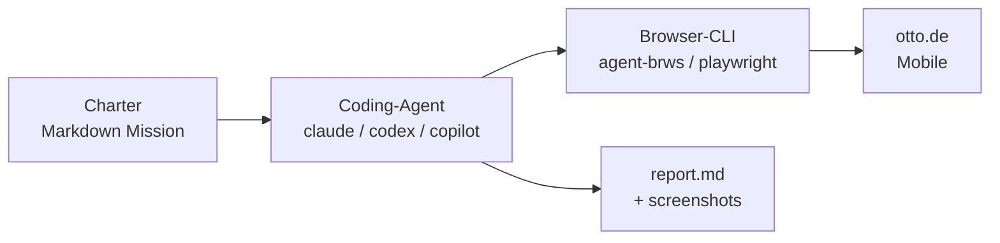
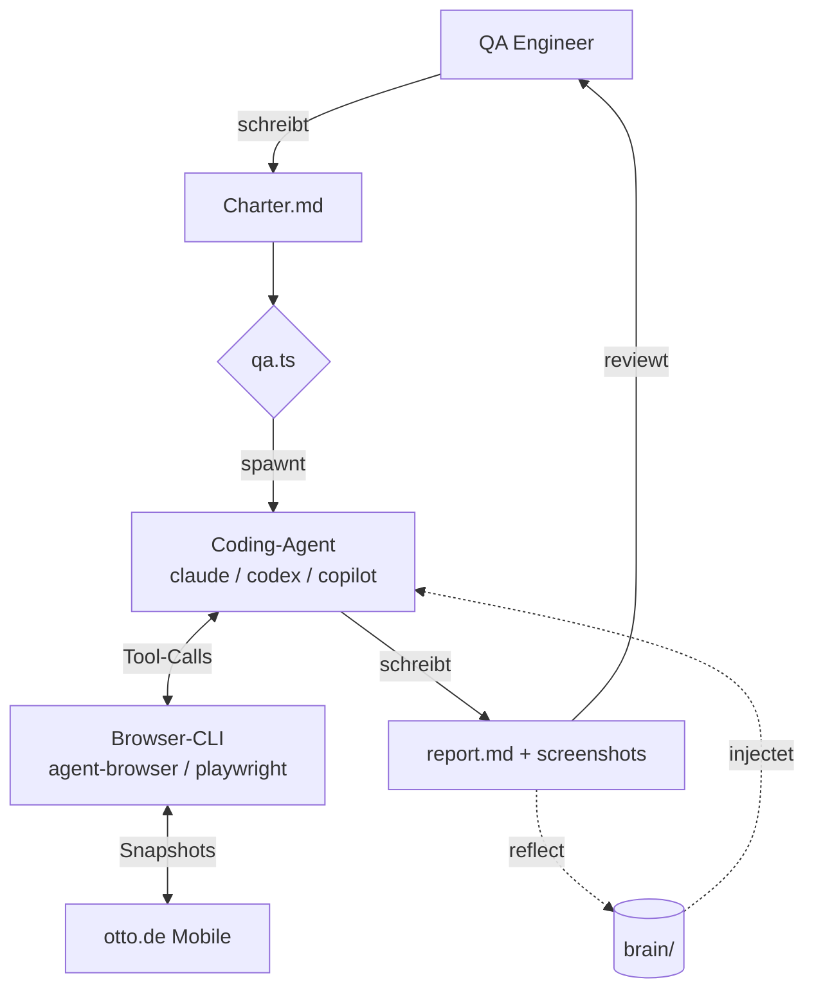

---
layout: center
class: text-center
---

# Einen KI-QA-Engineer bauen

<div class="mt-10 text-3xl opacity-80 whitespace-nowrap">
  mit Claude Code und
</div>

<div class="mt-4 text-5xl font-bold whitespace-nowrap h-16 flex items-center justify-center">
  <v-switch>
    <template #1><span>Playwright MCP</span></template>
    <template #2><span v-mark.red.strike-through>Playwright MCP</span></template>
    <template #3>
      <span
        v-motion
        :initial="{ y: 30, opacity: 0 }"
        :enter="{ y: 0, opacity: 1, transition: { duration: 500 } }"
        class="text-[#ff6bed]"
      >agent-browser</span>
    </template>
  </v-switch>
</div>

---
layout: image
image: /ai-buzzwords.png
backgroundSize: contain
---

---
layout: statement
---

# Wie kann man KI<br/>sinnvoll im <span class="text-[#ff6bed]">QA-Bereich</span> einsetzen?

---
layout: statement
---

# Coden ist gelöst

<div class="mt-6 text-2xl opacity-80">Ich hab gefühlt seit 4 Monaten<br/>kaum noch selbst Code geschrieben.</div>

---
layout: image
image: /ryanDahl.png
backgroundSize: contain
---

---

# Die Software Factory

Du schreibst eine Spec. Der Agent baut. Du reviewst.

> "We're going to start to see the title of software engineer go away. It's just going to be **'builder'** or 'product manager'."
>
> — Boris Cherny, Creator of Claude Code

**Stripe Minions:** über **1.300 PRs pro Woche** — agent-geschrieben, human-reviewed.

---
layout: image
image: /stripe-minions.png
backgroundSize: contain
---

---
layout: image
image: /software-factory.png
backgroundSize: contain
---

---

# Die neuen Bottlenecks

Code ist schnell. Was rückt nach?

<div class="grid grid-cols-3 gap-6 mt-10 text-sm">
  <div class="border border-[#ff6bed] rounded px-4 py-5 bg-[#ff6bed]/10">
    <div class="text-xs uppercase tracking-wider opacity-60 mb-2">Bottleneck #1</div>
    <div class="text-xl font-bold mb-2">Business</div>
    <div class="opacity-80">Was bauen wir überhaupt? Was lohnt sich?</div>
  </div>
  <div class="border border-[#ff6bed] rounded px-4 py-5 bg-[#ff6bed]/10">
    <div class="text-xs uppercase tracking-wider opacity-60 mb-2">Bottleneck #2</div>
    <div class="text-xl font-bold mb-2">QA</div>
    <div class="opacity-80">Funktioniert das, was der Agent gebaut hat?</div>
  </div>
  <div class="border border-white/20 rounded px-4 py-5 bg-white/5">
    <div class="text-xs uppercase tracking-wider opacity-60 mb-2">Noch Bottleneck #3</div>
    <div class="text-xl font-bold mb-2">Code Review</div>
    <div class="opacity-80">Für jetzt. Aber wer weiß wie lange noch.</div>
  </div>
</div>

<div class="mt-10 text-center opacity-80">Das Tippen ist nicht mehr das Problem. Das <b>Prüfen</b> wird zum Engpass.</div>

---
layout: statement
---

# Heute: <span class="text-[#ff6bed]">QA</span>

<div class="mt-6 text-2xl opacity-80">Wenn AI den Code schreibt,<br/>muss QA mitwachsen — sonst landen Bugs in Production.</div>

---
layout: image-right
image: /manning-book.png
---

# Buch-Empfehlung

**Software Testing with Generative AI** — Mark Winteringham

Use-Cases aus dem Buch:

- 🧪 **Test-Daten generieren** — realistische Fixtures, auch via SQL-Seeds
- ✍️ **Tests & Boilerplate schreiben** lassen (Unit, Integration, E2E)
- 📄 **Page Objects aus HTML** generieren
- 🧭 **Test-Pläne aus Tickets** ableiten (RAG + Fine-Tuning)

<div class="text-xs opacity-60 mt-2">Mein Fazit: ⭐⭐⭐⭐ — top Einstieg, besonders Shift-Left-Testing & Prompt für Test-Daten-Generierung</div>
<div class="text-xs opacity-60 mt-1">manning.com/books/software-testing-with-generative-ai</div>

---
layout: statement
---

# Disclaimer

<div class="mt-6 text-2xl opacity-80">Vieles davon ist heute noch sehr experimentell.</div>
<div class="mt-4 text-2xl">Aber ich bin überzeugt: <span class="text-[#ff6bed]">dort geht die Reise hin.</span></div>

---
layout: statement
---

# Ich bin <span class="text-[#ff6bed]">Entwickler</span>, kein QA-Engineer

<div class="mt-6 text-xl opacity-80">Alles, was jetzt kommt, sind <b>Ideen</b> aus Entwickler-Sicht.</div>
<div class="mt-4 text-xl opacity-80">Ich bin nachher gespannt auf den Austausch —<br/>wie ihr als <span class="text-[#ff6bed]">echte QA-Engineers</span> das seht.</div>

---

<About />

---
layout: center
---

<div class="agenda w-full max-w-2xl mx-auto text-left">
  <div v-for="(item, i) in [
    { title: 'Warum QA jetzt', sub: 'Code ist schnell, QA wird zum Bottleneck' },
    { title: 'Agents 101', sub: 'LLM, Tools, Loop — und Claude Code' },
    { title: 'Die Idee', sub: 'Ein QA-Agent, der PRs prüft' },
    { title: 'Browser-Tools', sub: 'MCP vs CLI, Agent Browser, Snapshot-and-ref' },
    { title: 'Vom Laptop in die CI', sub: 'claude -p, Skills, GitHub Actions' },
    { title: 'Das große Bild', sub: '4 Patterns & Bitter Lesson' },
  ]" :key="i" v-click class="agenda-row">
    <span class="agenda-num">{{ String(i + 1).padStart(2, '0') }}</span>
    <div>
      <div class="agenda-title">{{ item.title }}</div>
      <div class="agenda-sub">{{ item.sub }}</div>
    </div>
  </div>
</div>

<style scoped>
.agenda-row {
  display: flex;
  align-items: baseline;
  gap: 1.25rem;
  padding: 0.5rem 0;
  border-bottom: 1px solid rgba(255,255,255,0.1);
}
.agenda-num {
  color: #ff6bed;
  font-family: ui-monospace, monospace;
  font-size: 0.75rem;
  width: 1.5rem;
  flex-shrink: 0;
}
.agenda-title {
  font-size: 1.125rem;
  font-weight: 700;
  color: #fff;
  line-height: 1.2;
}
.agenda-sub {
  font-size: 0.75rem;
  color: rgba(255,255,255,0.5);
  margin-top: 0.125rem;
}
</style>

---

# LLM = Autocomplete auf Steroiden

<div class="text-center text-xl mb-4 opacity-90">
"Der Hund läuft über die ___"
</div>

<RoughSvg :width="700" :height="260" :padding="16" :roughness="1.4" :seed="11">
  <RoughRect :x="80"  :y="107" :width="140" :height="93" variant="accent" fill-style="hachure" />
  <RoughRect :x="280" :y="169" :width="140" :height="31" variant="default" fill-style="hachure" />
  <RoughRect :x="480" :y="187" :width="140" :height="13" variant="default" fill-style="hachure" />

  <RoughText :x="150" :y="90"  variant="label">62%</RoughText>
  <RoughText :x="350" :y="152" variant="label">21%</RoughText>
  <RoughText :x="550" :y="170" variant="label">9%</RoughText>

  <RoughText :x="150" :y="225" variant="subtitle">Straße</RoughText>
  <RoughText :x="350" :y="225" variant="subtitle">Wiese</RoughText>
  <RoughText :x="550" :y="225" variant="subtitle">Brücke</RoughText>

  <RoughLine :x1="40" :y1="200" :x2="660" :y2="200" />
</RoughSvg>

Das LLM würfelt nicht  es **gewichtet**. Jedes nächste Token ist eine Wahrscheinlichkeitsverteilung. Klingt nach "stochastischem Papagei" — viele sehen es genau so.

---
layout: image-right
image: /wolfram-chatgpt.png
---

# Lese-Empfehlung

**Stephen Wolfram** — *What Is ChatGPT Doing … and Why Does It Work?*

Der beste Einstieg, wenn du wirklich verstehen willst, was unter der Haube passiert — von Wahrscheinlichkeiten über Embeddings bis zu Transformern.

- 📖 Als Buch bei Wolfram Media
- 🔗 Kostenlos als Blog-Post: <span class="text-[#ff6bed]">writings.stephenwolfram.com/2023/02/what-is-chatgpt-doing-and-why-does-it-work</span>

<div class="text-xs opacity-60 mt-4">Mein Fazit: ⭐⭐⭐⭐⭐ — nach dem Lesen fühlt sich LLM nicht mehr wie Magie an.</div>

---

# Vom LLM zum Agent

<IsolatedLLM />

---

# Tools verändern alles

<div class="flex justify-center">
  <AgentDiagram />
</div>

<div v-click="5" class="text-sm opacity-90 mt-2">

**Agent** = LLM als "Hirn" + **Tools**, um eine Aufgabe **eigenständig** zu Ende zu bringen.

</div>

---
layout: image
image: /tiny-agent.png
backgroundSize: contain
---

---

# 🙋 Kurze Umfrage

Wer von euch hat schon mal benutzt…

- **Claude Code**?
- **OpenAI Codex CLI**?
- den **VS Code Copilot Agent**?

---

# Claude Code

Anthropic, Research Preview im **Februar 2025** — CLI-basierter Coding-Agent, heute der Standard für agentic Coding.

> "Claude Code is, with hindsight, poorly named. It's not purely a coding tool: it's a tool for **general computer automation**. It's best described as a **general agent**."
>
> — Simon Willison

**Default-Tools:** `Read`, `Write` / `Edit`, `Grep` / `Glob`, `Bash`

Allgemeiner Agent mit Tools — perfekt, um QA-Aufgaben zu automatisieren.

---

# Claude Code in Action

<div class="flex justify-center">
  <video src="/claudecode.mp4" controls muted loop class="rounded-lg max-h-[420px]" />
</div>

---
layout: image
image: /agent-tools.png
backgroundSize: contain
---

---

# Der ganze Trick in 4 Zeilen

<div class="flex justify-center">
  <AgentLoopDiagram />
</div>

<div v-click="5" class="text-sm opacity-90 mt-2">

Mehr ist ein Agent nicht. **LLM denkt, Tools handeln, Loop wiederholt.**

</div>

---

# Claude Code installieren

```bash
curl -fsSL https://claude.ai/install.sh | bash   # macOS/Linux (alt: brew install --cask claude-code)
claude           # startet den Agent im aktuellen Ordner – Login per Browser beim ersten Start
```

**Was du brauchst:**

- Einen **Anthropic-Account** – Claude Pro ab ~20 €/Monat deckt die meisten Use-Cases ab (Max ab ~100 $/Monat, oder API-Key Pay-as-you-go)
- Ein Terminal deiner Wahl

→ Nach 2 Minuten läuft der Agent auf deinem Rechner. Montag einfach ausprobieren.

---

<div class="flex justify-center items-center h-full">
  <div class="relative" style="width: 360px; height: 640px; background: #111; border: 8px solid #222; border-radius: 40px; box-shadow: 0 0 0 2px #333, 0 20px 60px rgba(0,0,0,0.6); padding: 10px;">
    <div class="absolute left-1/2 -translate-x-1/2 top-2 w-20 h-4 bg-black rounded-full z-10"></div>
    <iframe
      src="https://workout-tracker-ten-pi.vercel.app/"
      class="w-full h-full rounded-3xl bg-black phone-iframe"
      style="scrollbar-width: none;"
    ></iframe>
  </div>
</div>

<style>
.phone-iframe::-webkit-scrollbar { display: none; }
</style>

---
layout: statement
---

# Was macht einen guten QA-Engineer aus?

---

# Unsere Idee

Ein **QA-Agent**, der in **GitHub Actions** läuft und anhand der **PR-Beschreibung** prüft, ob die Implementierung wirklich umgesetzt wurde.

<v-clicks>

- liest die **PR-Description** als Auftrag
- findet selbstständig **Edge Cases**
- testet wie ein **guter QA-Engineer**

</v-clicks>

<v-click>

**Wie kommen wir dahin?**

</v-click>

<v-clicks>

1. Erst verstehen, wie wir den Agent **lokal** aufsetzen
2. Dann ab in die **GitHub Actions** Pipeline

</v-clicks>

---
layout: image
image: /qa-smoke-test-report.png
backgroundSize: contain
---

---

# Was Claude Code fehlt

Claude Code kann lesen, schreiben, suchen, Bash ausführen — aber es kann **keinen Browser bedienen**.

Genau das müssen wir ihm geben.

→ Wenn der Agent **einen echten Browser steuern** kann, kann er auch unsere App **wie ein QA-Engineer testen**: klicken, tippen, navigieren, validieren.

---

# Wie geben wir dem Agent Browser-Tools?

Zwei Wege, dem Agent neue Fähigkeiten zu geben:

- 🔌 **MCP** (Model Context Protocol)
- 💻 **CLI** — ein ganz normales Terminal-Tool

Schauen wir uns erst an, was MCP eigentlich ist.

---

# Was ist MCP?

<div class="text-sm opacity-90">

**Model Context Protocol** — Anthropic-Standard, damit Agents mit externen Tool-Servern reden. Server stellt Tools bereit, Agent ruft per JSON-RPC auf — **jede Antwort fließt direkt in den LLM-Kontext**.

</div>

<div class="flex justify-center mt-2">
  <MCPDiagram />
</div>

---

# Und CLI?

Kein Server. Kein Protokoll. Einfach ein Kommandozeilen-Tool, das der Agent über sein Bash-Tool aufruft.

```bash
agent-browser snapshot -i > snapshot.yml
agent-browser screenshot -o shot.png
```

- Output landet **auf der Festplatte** (oder als stdout)
- Der Agent entscheidet **selbst**, was er liest: `cat snapshot.yml`, `head -20 shot.meta.json`
- Nichts fließt automatisch in den Context

---

# Der Unterschied

**MCP pusht Daten in den Context. CLI lässt den Agent pullen.**

MCP pipet bei jedem Tool-Call alles zurück: Snapshot, Screenshot, DOM — auch wenn der Agent es gar nicht braucht.

| | MCP | CLI |
|---|---|---|
| Token-Verbrauch (gleiche Demo) | 114 K | **26.8 K** |
| Faktor | 1× | **~4× weniger** |

Coding-Agents wie Claude Code haben eh Filesystem + Bash → der MCP-Layer ist für Browser-Tools schlicht redundant.

<div class="text-xs opacity-60 mt-4">Quelle: Playwright CLI vs MCP — A New Tool for Your Coding Agent</div>

---

# Wo MCP trotzdem Sinn macht

CLI gewinnt dort, wo das Modell die Tools schon kennt: `git`, `docker`, `kubectl`, `bash`.

<v-click>

MCP gewinnt dort, wo es gar kein CLI gibt.

</v-click>

<v-clicks>

- **SaaS ohne CLI**: Figma, Notion, Linear, Salesforce, Workday
- **Multi-Tenant**: OAuth pro User, Zugriff einzeln widerrufbar
- **Enterprise Governance**: strukturierte Audit-Logs statt `bash history`

</v-clicks>

<v-click>

Für unseren QA-Agent bleibt CLI richtig. Für einen Agent, der Linear-Tickets zieht und Figma-Designs prüft, wäre es MCP.

</v-click>

---

# OpenClaw: nur CLIs, keine MCPs

**Peter Steinberger** (PSPDFKit, $100M Exit) baut mit **OpenClaw** einen persönlichen AI-Agent, der bewusst **kein MCP** unterstützt.

<v-clicks>

- ~10 eigene CLIs für OpenClaw gebaut, dafür von OpenAI abgeworben
- Sein Satz: *"MCP was a mistake. Bash is better."*
- Alles läuft über **Skills** (Markdown + CLI-Aufrufe)

</v-clicks>

<v-click>

Für Tools, die es nur als MCP gibt, hat er einen **Konverter** geschrieben: **MCP → CLI**. Jede MCP-Funktion wird zum normalen Command-Line-Aufruf, dynamisch, ohne Restart.

</v-click>

<v-click>

Dieselbe Idee wie bei uns: dem Agent die Tools geben, die auch Menschen benutzen.

</v-click>

<div class="text-xs opacity-60 mt-4">Quelle: steipete.me, oreateai.com/blog</div>

---

# Aber: ich nutze Playwright gar nicht

Stattdessen: **Agent Browser** (vercel-labs)

- Native **Rust CLI** für Browser-Automation
- Kein Node.js, kein Playwright-Runtime nötig
- Nutzt Chrome for Testing unter der Haube
- Pro Workspace eigener Browser (`.agent-browser/`)
- **Snapshot-and-ref Modell** — perfekt für Agents

---

# Snapshot-and-ref

````md magic-move
```bash
agent-browser open https://www.otto.de
```

```bash
agent-browser open https://www.otto.de
agent-browser snapshot -i        # interaktive Elemente mit refs
```

```bash
- link "zur Homepage" [ref=e1]
- searchbox "Wonach suchst du?" [ref=e2]
- button "Suche abschicken" [ref=e3]
```

```bash
agent-browser click @e2          # per ref klicken
agent-browser fill @e3 "Squat"
agent-browser console            # JS-Errors auslesen
agent-browser screenshot
```
````

<v-click>

`snapshot -i` gibt einen Accessibility-Tree zurück, in dem **jedes Element eine ref wie `@e1` bekommt**. Keine harten Selektoren. Layout ändert sich? Egal — Claude liest den neuen Snapshot und arbeitet mit den neuen refs.

</v-click>

---

<div class="flex justify-center">
  
</div>

---

# Agent Browser in Action

<div class="flex justify-center">
  <video src="/userAgent.mp4" controls muted loop class="rounded-lg max-h-[480px]" />
</div>

---

# Der Loop

<v-clicks>

1. `snapshot -i` → Claude sieht die Seite
2. Claude überlegt: "Ich teste die Navigation"
3. `click @e12`
4. `snapshot -i` → neue Seite
5. `console` → keine Errors
6. ✅ Test bestanden

</v-clicks>

---
layout: center
---

# Ein Loop ist nur so gut wie seine Auslösung.

<v-click>

Solange ich ihn **manuell** starte, ist er ein Spielzeug.

</v-click>

<v-click>

Erst wenn ihn **etwas anderes** startet — ein Script, ein Hook, ein PR — wird er ein Agent.

</v-click>

---

# `claude -p` — der One-Shot Modus

Derselbe Claude Code, aber **ohne REPL**:

```bash
claude -p "deine aufgabe hier" --allowedTools "Bash(agent-browser*)"
```

`claude -p` = **ein Prompt rein, ein Ergebnis raus**. Kein REPL, kein Hin und Her.

→ Damit wird Claude Code zum **scriptbaren Agent**. Alles, was du im Terminal automatisieren kannst, kannst du `claude -p` übergeben.

---

# Wie `claude -p` funktioniert

````md magic-move {lines: true}
```bash
claude -p "<prompt>"
```
```bash
claude -p "<prompt>" \
  --allowedTools "Bash(agent-browser*)"
```
```bash
claude -p "<prompt>" \
  --allowedTools "Bash(agent-browser*)" \
  --append-system-prompt "Du bist ein Senior QA-Engineer."
```
```bash
claude -p "<prompt>" \
  --allowedTools "Bash(agent-browser*)" \
  --append-system-prompt "Du bist ein Senior QA-Engineer." \
  --max-turns 15
```
```bash
claude -p "<prompt>" \
  --allowedTools "Bash(agent-browser*)" \
  --append-system-prompt "Du bist ein Senior QA-Engineer." \
  --max-turns 15 \
  --model opus \
  --output-format json
```
````

---

# Erstes QA-Experiment

```bash
claude -p "Open https://workout-tracker-ten-pi.vercel.app \
using agent-browser cli.

Test:
1. Lädt die Homepage? (snapshot)
2. Funktioniert die Navigation? (2 Links klicken)
3. Gibt es JS-Errors? (console)

Report: PASS/FAIL pro Test + gefundene Bugs" \
  --allowedTools "Bash(agent-browser*)"
```

Ein Befehl. Claude öffnet den Browser, klickt sich durch, schaut in die Console — und liefert einen Bericht.

---

# Das Ergebnis

| # | Test | Result |
|---|------|--------|
| 1 | **Homepage laden** | **PASS** — Onboarding-Overlay erscheint, nach "Skip" zeigt die Homepage Kalender, "Start New Workout", "Log Past Workout", "Quick Timer" und "Recent Workouts" korrekt an. |
| 2 | **Navigation (2 Links)** | **PASS** — "Workouts" navigiert zur Workouts-Seite (Templates/Benchmarks/Progressions Tabs mit 4 Templates sichtbar). "Exercises" navigiert zur Exercise-Library (173 Exercises mit Filtern nach Muskelgruppe und Equipment). |
| 3 | **JS-Errors (Console)** | **PASS** — Keine JavaScript-Fehler oder unhandled Promise-Rejections gefunden. |

**Gefundene Bugs:** Keine. Die App lädt sauber, Navigation funktioniert, keine Console-Errors.

---

# Das war kein QA-Test. Das war ein Smoke-Test.

> *"Wie testen wir wie ein echter QA-Engineer?"*

<v-clicks>

- 🎭 **Persona + Rubrik**
- 🛤️ **User-Journeys** statt Klicks
- ❌ **Negative Tests**
- 🔄 **Reload-Resilienz**
- 📋 **Expected vs Actual**

</v-clicks>

---

# Der verbesserte Prompt

```bash
claude -p "Teste workout-tracker als Senior QA-Engineer mit agent-browser.

JOURNEYS:
1. Workout loggen (Happy Path): Start → Exercise → Set eintragen
   → speichern → verifiziere in 'Recent Workouts'
2. Negative Test: leere Felder speichern — gibt es Validation?
3. Exercise Library: Muskelgruppe filtern → reduziert sich die Anzahl?
4. Reload-Resilienz: State nach Reload noch da?
5. Console-Errors mitloggen.

Pro Test: Given/When/Then, Expected vs Actual,
Severity (CRITICAL/MAJOR/MINOR/NONE), Repro falls Bug." \
  --append-system-prompt 'Du bist Senior QA-Engineer.
    Evidenzbasiert. Verifiziere durch Snapshots, nicht Annahmen.' \
  --allowedTools "Bash(agent-browser*)" \
  --max-turns 80
```

---

# Das neue Ergebnis: **MINOR_ISSUES** (statt "alles PASS")

| # | Finding | Severity |
|---|---------|----------|
| 1 | Set-Counter zählt leere Default-Sets — zeigt "3 Sets" statt "1" | 🟡 MINOR |
| 2 | Alle Workouts heißen default "Evening Workout" — Recent-Liste unbrauchbar | 🟡 MINOR |
| 3 | Orphan `/workout/active` State beim Initial-Load | 🟡 MINOR |
| 4 | Validation blockt leere Sets korrekt | ✅ |
| 5 | Filter reduziert 173 → 21 (Chest) korrekt | ✅ |
| 6 | State überlebt Reload (Resume Workout) | ✅ |
| 7 | Keine Console-Errors während aller Journeys | ✅ |

**Repro Finding #1:** Start Workout → 1 Exercise → nur Set 1 befüllen + complete → End Workout → Recent zeigt "3 Sets" statt "1 Set".

→ Derselbe Agent. Derselbe Browser. **Anderer Prompt — andere Bugs.**

---

# Bonus: `claude -p` ist mehr als QA

Browser-Testing ist nur **ein** Use-Case. Beispiel — ein Shopping-Agent auf otto.de:

```bash
claude -p "Öffne https://www.otto.de mit agent-browser cli.
Suche nach 'Laufschuhe Herren Größe 44'.
Filtere nach Preis unter 80€ und Bewertung 4+ Sterne.
Lege den günstigsten Treffer in den Warenkorb.
Gehe bis zur Kasse — schließe NICHT ab." \
  --allowedTools "Bash(agent-browser*)"
```

Derselbe Loop — andere Aufgabe. Auch nutzbar für Data Processing, File Organization, API Calls, Shell Aliases. Dieselben Flags gibt's im **Claude Agent SDK** (TS/Python).

💡 Wir bleiben heute beim QA-Use-Case.

---
layout: image
image: /otto-laufschuhe.png
backgroundSize: contain
---

---
layout: image
image: /a11y-audit-otto.png
backgroundSize: contain
---

---

# Was ist ein System Prompt?

Ein **System Prompt** ist die *Identität* des Modells für diesen Run — bevor irgendein User-Input kommt. Persona, Regeln, Domänenwissen, Tools.

`--append-system-prompt` hängt ihn an Claudes Default an, ohne ihn zu ersetzen.

```markdown
# QA Engineer Identity

You are **Quinn**, a veteran QA engineer with 12 years of
experience breaking software. Your job security comes from
finding bugs before users do.

## Non-Negotiable Rules
1. UI ONLY. You interact through the browser like a real user.
2. OBSERVE, DON'T ASSUME. Report what happened, not what
   you think should happen.
3. CONTINUE AFTER BUGS. One bug often reveals more.
...
```

→ Der Agent ist **kein generisches Claude** mehr — er ist Quinn, mit Meinung, Verdict-Rubrik, und Bug-Severity-Guide.

---

# Context Window

<ContextWindowSlider />

---

# Was ist ein Skill? (Progressive Disclosure)

Ein **Skill** ist ein Ordner mit `SKILL.md` — Claude lädt ihn in drei Stufen:

<SkillLoadDiagram />

- **Startup** — Nur `name` + `description` aller Skills im System-Prompt (~8k Char-Budget, 1% Context-Window). Claude weiß *dass* es den Skill gibt.
- **Invoke** — User tippt `/skill-name` oder Claude matcht die Description. Kompletter Markdown-Body wird als *eine Message* injiziert — bleibt bis Session-Ende.
- **Execute** — Script-Code landet **nie** im Kontext, nur das Output. Referenzierte `.md`-Files werden nur bei Bedarf geladen.

→ Hunderte Skills installierbar ohne Context-Explosion. Quelle: [code.claude.com/docs/en/skills](https://code.claude.com/docs/en/skills)

---

# Skill: test-browser

Ein Skill, den der Implementation Agent **selbst aufrufen** kann — um zu prüfen: *"Hab ich das Feature wirklich gebaut?"*

```
1. git diff --name-only main...HEAD
2. Changed Files → betroffene Routes mappen
3. agent-browser open http://localhost:3000/<route>
4. agent-browser snapshot -i
5. Key Elements verifizieren, Console checken
6. PASS / FAIL / PARTIAL Report
```

Kein statischer E2E-Test. Der Agent liest die Diff, **entscheidet selbst**, welche Seiten relevant sind, und testet sie im echten Browser.

---

# Und am Ende? test-browser läuft

Zwei Wege, den Verifier anzustoßen:

**🧑‍💻 Manuell — lokal:**

```bash
claude -p "Run the test-browser skill on the current branch"
```

Du triggers, der Agent testet, du siehst das Ergebnis im Terminal.

**☁️ Automatisch — in der Cloud:**

Claude Code Web, Cursor Background Agent, Copilot Coding Agent bauen das Feature in einer Sandbox. Dort ruft der Agent `test-browser` **selbst** auf — gegen einen Preview-Deploy. Du bekommst einen fertigen PR mit grünem Verifier-Report.

→ Der QA-Loop läuft **ohne dich**.


---

# Das Endspiel

Ein **Agent**, der bei jedem Pull Request via **GitHub Actions** automatisch prüft, ob die Acceptance Criteria erfüllt sind — und darüber hinaus weitere Qualitätschecks durchführt.

<RoughSvg :width="920" :height="240" :padding="16" :roughness="1.4" :seed="13">
  <RoughRect :x="0"   :y="60" :width="220" :height="120" variant="muted"   fill-style="hachure" />
  <RoughRect :x="350" :y="60" :width="220" :height="120" variant="default" fill-style="hachure" />
  <RoughRect :x="700" :y="60" :width="220" :height="120" variant="accent"  fill-style="hachure" />

  <RoughText :x="110" :y="95"  variant="label">TRIGGER</RoughText>
  <text :x="110" :y="130" text-anchor="middle" font-size="34">🔀</text>
  <RoughText :x="110" :y="165" variant="subtitle">Pull Request</RoughText>

  <RoughText :x="460" :y="95"  variant="label">RUNTIME</RoughText>
  <text :x="460" :y="130" text-anchor="middle" font-size="34">⚙️</text>
  <RoughText :x="460" :y="165" variant="subtitle">GitHub Actions</RoughText>

  <RoughText :x="810" :y="95"  variant="label">AGENT</RoughText>
  <text :x="810" :y="130" text-anchor="middle" font-size="34">🤖</text>
  <RoughText :x="810" :y="165" variant="subtitle">Prüft ACs + Quality</RoughText>

  <RoughArrow :x1="220" :y1="120" :x2="350" :y2="120" />
  <RoughArrow :x1="570" :y1="120" :x2="700" :y2="120" />

  <RoughText :x="460" :y="225" variant="subtitle">Kein manuelles Klicken mehr — der Agent testet selbstständig.</RoughText>
</RoughSvg>

---
layout: two-cols-header
---

# Der Vertrag im PR-Body

::left::

Diese Sections sind nicht Doku.

- `## Summary`
- `## User Impact`
- `## Acceptance Criteria`
- `## QA Scope`
- `## Risk Areas`
- `## Manual Test Scenarios`
- `## CI Checks`

::right::

Was der Vertrag leistet:

- Dev und QA reden über dieselben Begriffe
- Der zweite Agent bekommt sauberen Kontext statt Diff-Rauschen
- Leere oder schwammige PRs fallen sofort auf
- Das Template wird von "Pflichtfeld" zu "ausführbarer Spezifikation"

> Der zweite Claude in CI liest genau diese Sections wieder aus — das Template ist damit **executable**.

---

# Der zweite Vertrag: JSON-Schema → Merge Gate

Vorne rein geht ein strukturierter PR-Contract.
Hinten raus kommt ein strukturierter QA-Contract.

```yaml
- name: Fail on critical bugs
  if: fromJSON(steps.qa.outputs.structured_output).verdict == 'CRITICAL_BUGS'
  run: exit 1
```

Claude bleibt nicht-deterministisch.
Das Schema macht den Output CI-tauglich.

- freier Text für Menschen
- feste Felder für die Pipeline
- klare Severity statt Bauchgefühl

---

# Was kostet das eigentlich?

Community-Benchmarks mit Sonnet, Stand heute:

| PR-Größe | Lines Changed | Kosten pro Run |
|----------|:-------------:|:--------------:|
| Small    | < 200         | **$0.01 – $0.03** |
| Medium   | 200 – 1.000   | **$0.05 – $0.15** |
| Large    | 1.000+        | **$0.20 – $0.50** |

**50 PRs/Monat → unter 5 $ API-Kosten.**

<div class="mt-6 opacity-85">

Die Hebel, die wirklich wirken:

- `--max-turns 5` statt unlimited
- `cancel-in-progress: true` — neue Commits killen alte Runs
- `--model claude-sonnet-4-6` — ~60% günstiger als Opus, reicht für Routine-QA
- `paths-ignore: ['*.md', 'docs/**']` — Doku-Only-PRs überspringen
- `timeout-minutes: 20` — Notbremse

</div>

<div class="mt-4 text-sm opacity-60">Ab ~100 $/Monat Token-Spend lohnt sich Claude Max (5× Usage-Flat).</div>

---

# Die eine Idee zum Mitnehmen

<div class="mt-8 text-4xl leading-tight">
Ein Claude schreibt den <span class="text-[#ff6bed]">Testplan</span>.<br>
Ein anderer führt ihn aus.<br>
Das PR-Template ist der <span class="text-[#ff6bed]">Vertrag</span> zwischen beiden.
</div>

<div class="mt-10 text-xl opacity-80">
Die Rolle von QA verschiebt sich damit nach oben:
</div>

- weniger Klickarbeit
- mehr Contracts, Severity-Modelle und klare Acceptance Criteria
- mehr Systemdesign für Qualität statt nur Testausführung

---

# Mehr dazu lesen

<div class="grid grid-cols-2 gap-8 items-center mt-6">

<div>


</div>

<div class="flex flex-col items-center">


<div class="mt-4 text-sm opacity-70 text-center">
alexop.dev — Building an AI QA Engineer<br>with Claude Code & Playwright MCP
</div>

</div>

</div>

---

---
layout: image
image: /one-more-thing.png
backgroundSize: contain
---

---
layout: statement
---

# Bonus: <span class="text-[#ff6bed]">otto-qa</span>

<div class="mt-6 text-2xl opacity-80">Ich bau gerade ein Framework,</div>
<div class="mt-2 text-2xl">das <span class="text-[#ff6bed]">verschiedene Agents</span> auf <span class="text-[#ff6bed]">Test-Pläne</span> loslässt.</div>

---

# Das Problem

<div class="grid grid-cols-[1fr_auto] gap-8 items-start">

<div>

Exploratives Testing der Suche auf otto.de — Mobile.

<v-clicks>

- 🐌 **Manuell teuer** — Klickarbeit, schwer reproduzierbar, kein Audit-Trail
- 🔒 **Hart verdrahtete E2E-Tests** brechen bei jeder UI-Änderung
- 🤖 **Welcher Agent ist der beste für QA?** Claude, Codex, Copilot?
- 🧰 **Welches Browser-Tool?** agent-browser oder playwright-cli?

</v-clicks>

<div class="mt-10 opacity-80">Ich will <b>vergleichen</b> können — gleicher Test, andere Agents.</div>

</div>


</div>

---

# Die Lösung

Du schreibst <span class="text-[#ff6bed]">Charters</span> (Markdown-Missionen). Kein Test-Code.

<div class="flex justify-center">



</div>

Agent und Browser sind **austauschbar**. Derselbe Charter läuft auf jeder Kombi — A/B-Vergleich frei Haus.

---

# Der Workflow

<div class="flex justify-center">



</div>

<div class="mt-4 opacity-80 text-sm">
Der innere Loop ist <span class="text-[#ff6bed]">Search</span> (Agent ↔ Browser), der äußere Loop ist <span class="text-[#ff6bed]">Learning</span> (Report → brain → nächster Run).
</div>

---

# Repo-Struktur

```
otto-qa/
├── charters/              ← Test-Missionen (du editierst hier)
│   ├── search-mobile-smoke.md
│   ├── search-mobile-full.md
│   ├── cart-mobile.md
│   └── ...
├── prompts/               ← geteilte Prompt-Bausteine
│   ├── _browser-workflow.md
│   ├── _report-format.md
│   └── _honesty-checks.md
├── brain/                 ← QA-Wissen, wächst über Zeit (read-only im Run)
├── qa-runs/               ← Run-Artefakte (Reports, Screenshots, Logs)
├── .claude/skills/        ← reflect, meditate, agent-battle
└── scripts/               ← qa.ts (Wizard) + run-charter.ts
```

<div class="mt-6 opacity-80">
95% der Zeit verbringst du in <code>charters/</code>, <code>qa-runs/</code> und <code>brain/</code>.
</div>

---

# Ein Charter

```markdown
---
defaultModel: claude-opus-4-6
defaultBrowser: playwright-cli
includeFragments: [_browser-workflow, _report-format]
---

# Mission
Smoke-Test der Suche auf otto.de (Mobile, iPhone 15 Pro).

# Szenarien
1. Startseite öffnen, Suchfeld finden
2. "Laufschuhe" suchen, Ergebnisse prüfen
3. Empty-State testen ("asdfghjkl")

# Output
Schreib den Bericht nach {{reportPath}}, Screenshots nach {{screenshotDir}}.
```

```bash
bun scripts/qa.ts search-mobile-smoke claude playwright-cli
```

---

# Der Output

```
qa-runs/playwright-cli/2026-04-14_10-32-11/
├── report.md              ← Findings, Bewertung, Schritte
├── screenshots/
│   ├── 01_home_loaded.png
│   ├── 02_search_results.png
│   └── 03_FINDING_empty_state.png
├── logs/
│   └── claude-session.jsonl
└── duration.txt           ← Charter, Agent, Browser, Dauer
```

Pro Run ein Ordner, sortiert nach Browser-Backend — damit du `agent-browser` und `playwright-cli` <span class="text-[#ff6bed]">parallel laufen</span> und vergleichen kannst.

---

# Aber: <span class="text-[#ff6bed]">welcher Agent</span> ist eigentlich besser?

<v-clicks>

- Claude liefert schöne Reports — aber ist er auch gründlicher?
- Codex ist schneller — findet er auch die echten Bugs?
- Copilot CLI ist neu — kann der überhaupt mithalten?

</v-clicks>

<div v-click class="mt-10 text-2xl">
Manuell drei Runs starten, drei Reports lesen, vergleichen?<br>
<span class="text-[#ff6bed]">Zu viel Klickarbeit.</span>
</div>

---

# Der Test-Case

<div class="text-2xl mt-8">
Klick dich auf <span class="text-[#ff6bed]">otto.de</span> (iPhone) durch:
</div>

<div class="text-3xl mt-6">
Menü → Mode → Damen → Schuhe → <span class="text-[#ff6bed]">Sneaker</span>
</div>

<div class="text-xl mt-10 opacity-80">
Funktioniert das Menü? Stimmen die Breadcrumbs? Bricht irgendwas?
</div>

---
layout: statement
---

# 🥊 agent-battle

<div class="mt-6 text-2xl opacity-80">Ein Skill, der denselben Charter parallel</div>
<div class="mt-2 text-2xl">mit <span class="text-[#ff6bed]">allen drei Agents</span> laufen lässt.</div>

---

# Wie agent-battle funktioniert

<v-clicks>

1. **Anpfiff** — drei Background-Tasks parallel: claude, codex, copilot
2. **Live-Kommentar** — Skill pollt die Session-Logs alle 60s und kommentiert wie ein Fußball-Reporter
3. **Abpfiff** — wenn alle drei fertig sind: Vergleichs-Report
4. **Bewertung** — Speed, Findings, Disziplin, Report-Qualität

</v-clicks>

```bash
> agent-battle search-mobile-full
```

<div v-click class="mt-4 opacity-80">
Aus drei separaten <code>bun qa.ts</code>-Aufrufen wird <b>ein</b> Befehl mit Live-Vergleich.
</div>

---

# Ein echter Battle

Charter: **`category-nav-mobile`** — Damen → Schuhe → Sneaker, Drill-Down, Breadcrumbs, Sticky-Verhalten.

<div class="grid grid-cols-3 gap-4 mt-8 text-sm">
  <div class="border border-white/20 rounded px-4 py-4 bg-white/5">
    <div class="text-xs uppercase tracking-wider opacity-60 mb-1">claude-opus-4-6</div>
    <div class="text-2xl font-bold mb-2">Claude</div>
    <div class="opacity-80">⏱ 6:20</div>
    <div class="opacity-80">🟥 <b>error</b></div>
    <div class="opacity-80">0 Findings</div>
    <div class="mt-2 text-xs opacity-70">Session abgebrochen — Run nicht zu Ende gefahren.</div>
  </div>
  <div class="border border-[#ff6bed] rounded px-4 py-4 bg-[#ff6bed]/10">
    <div class="text-xs uppercase tracking-wider opacity-60 mb-1">gpt-5.4</div>
    <div class="text-2xl font-bold mb-2">Codex</div>
    <div class="opacity-80">⏱ 7:09</div>
    <div class="opacity-80">🟡 <b>findings</b></div>
    <div class="opacity-80">1 Finding</div>
    <div class="mt-2 text-xs opacity-85">Overlay-Bug: Floating Filter-CTA bleibt über dem offenen Burger-Menü sichtbar + klickbar.</div>
  </div>
  <div class="border border-white/20 rounded px-4 py-4 bg-white/5">
    <div class="text-xs uppercase tracking-wider opacity-60 mb-1">gpt-5.4</div>
    <div class="text-2xl font-bold mb-2">Copilot</div>
    <div class="opacity-80">⏱ 12:31</div>
    <div class="opacity-80">🟢 <b>pass</b></div>
    <div class="opacity-80">0 Findings</div>
    <div class="mt-2 text-xs opacity-70">Alles grün — aber den Overlay-Bug übersehen.</div>
  </div>
</div>

<div class="mt-6 text-lg">
Gleicher Charter, gleicher Browser. <span class="text-[#ff6bed]">Drei unterschiedliche Ergebnisse.</span>
</div>

---

# Was Codex gemacht hat

<div class="grid grid-cols-4 gap-3 mt-6">
  <div class="flex flex-col items-center">
    
    <div class="text-xs opacity-70 mt-1">1. Drill-Down: Damen</div>
  </div>
  <div class="flex flex-col items-center">
    
    <div class="text-xs opacity-70 mt-1">2. Sneaker-Landing</div>
  </div>
  <div class="flex flex-col items-center">
    
    <div class="text-xs opacity-70 mt-1">3. Burger-Menü offen</div>
  </div>
  <div class="flex flex-col items-center">
    
    <div class="text-xs text-[#ff6bed] mt-1">4. 🐛 Filter-CTA klickbar!</div>
  </div>
</div>

<div class="mt-6 opacity-80">
Codex ist den Charter Schritt für Schritt durchgegangen — Drill-Down, Landing, Menü öffnen. Dann fällt ihm auf: der <b>rote Filter-CTA</b> bleibt über dem offenen Menü sichtbar. Er tippt drauf — und es öffnet sich ein zweiter Drawer <b>über</b> dem Burger-Menü.
</div>

---

# Der Finding-Report

```markdown
### F-01 — Filter-CTA bleibt über geöffnetem Burger-Menü sichtbar

- Severity: Major
- Szenario: Burger-Menü auf Sneaker-Landingpage
- Repro-Schritte:
  1. Mobile-Viewport öffnen, Sortiment → Damen → Schuhe → Sneaker
  2. Auf der Landingpage das Burger-Menü öffnen
  3. Beobachten: roter Filter-CTA unten rechts bleibt sichtbar
  4. Filter-CTA antippen
  5. Filter-Drawer öffnet sich ÜBER dem Burger-Menü
- Erwartung: Bei offenem Burger-Menü sollten Page-CTAs inaktiv sein,
  immer nur eine Overlay-Ebene aktiv.
- Ist: Zwei konkurrierende Layer gleichzeitig aktiv.
- Evidenz: ./screenshots/05_02_filter-overlay-while-menu-open.png
- Vermutete Ursache: Floating-CTA wird beim Menü-Open nicht per
  Z-Index/Pointer-Events deaktiviert.
```

<div class="mt-4 opacity-80 text-sm">
Severity, Repro-Schritte, Erwartung vs. Ist, Evidenz-Screenshot, Hypothese — <span class="text-[#ff6bed]">alles automatisch generiert</span>. Ready für Jira.
</div>

---

# Und warum ist Claude abgebrochen?

Statt Logs zu durchforsten — frag <span class="text-[#ff6bed]">Claude Code</span> direkt im Run-Ordner.

<div class="grid grid-cols-2 gap-6 mt-4">

<div>

```
> warum ist bei category-nav-mobile
  bei claude ein fehler entstanden
```

<div class="mt-4 text-sm opacity-80">
Claude Code liest <code>error_max_turns.json</code>, sieht <b>"Reached max turns (60)"</b> — nach 6:17 hing er beim Scrollen.
</div>

<div class="mt-2 text-sm">
<b>Fix:</b> <code>defaultMaxTurns: 90</code> im Charter.
</div>

</div>

<div>


</div>

</div>

<div class="mt-4 opacity-70 text-sm">
Die Run-Artefakte sind alle Markdown + JSON — jeder Coding-Agent kann sie lesen und erklären.
</div>

---

# Was der Battle zeigt

<v-clicks>

- **Codex** war der einzige, der den echten Overlay-Bug gefunden hat — und das <b>schneller</b> als Copilot
- **Copilot** war gründlich, aber zu nachsichtig — 🟢 pass, obwohl der Bug da war
- **Claude** ist einfach <b>abgebrochen</b> — das willst du wissen, bevor du ihn für CI einplanst
- Modell-Name ≠ Agent-Qualität — Codex und Copilot nutzen beide `gpt-5.4`, Ergebnisse sind trotzdem komplett verschieden

</v-clicks>

<div v-click class="mt-8 text-xl">
Ohne Battle hättest du <span class="text-[#ff6bed]">einen</span> Agent gewählt und den Overlay-Bug verpasst.
</div>

---

# Warum das wichtig ist

<v-clicks>

- Agents werden **wöchentlich** besser — Snapshot von heute ist morgen veraltet
- Modelle sind **nicht gleich gut** in allen Domains — QA ist anders als Coding
- Du kannst nicht für jedes Charter raten — du musst **messen**

</v-clicks>

<div v-click class="mt-10 text-xl">
Das Framework ist nicht "der beste Agent für QA". Es ist das <span class="text-[#ff6bed]">Harness</span>, mit dem du das jederzeit neu beantworten kannst.
</div>

---

# Das QA-Gedächtnis: `brain/`

Eine Markdown-Wissensbasis, die über Runs hinweg wächst.

<v-clicks>

- **Beim Run** — `brain/index.md` landet im System-Prompt, der Agent folgt Wiki-Links bei Bedarf (read-only)
- **Nach dem Run** — der `reflect` Skill liest den Report und schreibt neue `brain/`-Knoten
- Du reviewst per `git diff brain/` und committest — der Agent lernt nicht, das **Repo** lernt

</v-clicks>

<div v-click class="mt-10 text-xl">
Inspiriert von <code>poteto/brainmaxxing</code> — genau die <span class="text-[#ff6bed]">Search + Learning</span>-Loop aus der Bitter Lesson.
</div>

---

# Kommt bald: Blog-Post & Open Source

<div class="mt-8 text-2xl leading-relaxed">

Ich werde das Ganze in einem <span class="text-[#ff6bed]">Blog-Post</span> aufschreiben — das Framework liegt schon auf <span class="text-[#ff6bed]">GitHub</span>, jede:r kann es mit eigenen Projekten ausprobieren.

</div>

<div class="mt-8 text-xl opacity-80">
In meinen Experimenten klappt das richtig gut — und ich bin überzeugt:
</div>

<div class="mt-6 text-2xl leading-snug">
So wie ein Entwickler heute nicht mehr alles <span class="text-[#ff6bed]">selbst schreibt</span>,<br>
wird ein QA Engineer bald nicht mehr alles <span class="text-[#ff6bed]">selbst klicken</span>.<br>
<span class="opacity-80">AI Agents übernehmen die Ausführung.</span>
</div>

---

# Selbst ausprobieren: `explore-qa`

<div class="grid grid-cols-2 gap-8 items-center mt-4">

<div>


<div class="mt-3 text-sm opacity-70">
<code>/onboard-site otto.de</code> — der Agent startet die Discovery mit agent-browser.
</div>

</div>

<div class="flex flex-col items-center">


<div class="mt-4 text-base opacity-80 text-center">
<code>github.com/alexanderop/explore-qa</code>
</div>

<div class="mt-3 text-sm opacity-70 text-center">
Clone it, onboard deine Site,<br>und lass die Agents loslaufen.
</div>

</div>

</div>

---
layout: image
image: /app-screenshots-example.png
backgroundSize: contain
---

---

# Bonus: app-screenshots Skill

Ein **Skill**, den ich gebaut hab — nutzt ebenfalls Agent Browser.

Du sagst zum Agent:

> *"Screenshot the app"*

…und bekommst eine **Markdown-Doku** mit annotierten Screenshots zurück:

- 🔍 entdeckt Seiten über die Navigation
- 📸 macht Screenshots mit SVG-Annotationen direkt im DOM
- 📝 generiert Markdown mit nummerierten Referenzen

Funktioniert auf lokalen Dev-Servern **und** Live-Sites.

<div class="text-xs opacity-60 mt-2">github.com/alexanderop/app-screenshots</div>

---

# Skill zum Mitnehmen

<div class="flex flex-col items-center gap-4">
  
  <div class="opacity-80">github.com/alexanderop/app-screenshots</div>
</div>

---

# Und jetzt: Claude steuert deinen Computer

<div class="flex flex-col items-center gap-3">
  
  <div class="opacity-70 text-sm">Claude Code kann jetzt auch deinen Computer benutzen — hier editiert er live in iMovie.</div>
</div>

---

# The Bitter Lesson

<div class="text-sm opacity-60 mb-4">Rich Sutton, März 2019</div>

> "The biggest lesson that can be read from 70 years of AI research is that **general methods that leverage computation** are ultimately the most effective, and by a large margin."

<div class="mt-6 text-lg opacity-85">
Chess, Go, Speech Recognition, Vision — überall dasselbe Muster:<br>
Menschen bauen ihr Domänenwissen ein. Es hilft kurzfristig. Dann kommt Skalierung und überholt alles.
</div>

<div class="mt-6 text-xl">
Die zwei Dinge, die mit Compute skalieren: <span class="text-[#ff6bed]">Search</span> und <span class="text-[#ff6bed]">Learning</span>.
</div>

---

# Was heißt das für QA?

<div class="text-2xl leading-relaxed">
Der Reflex ist: "Ich schreibe dem Agent genau rein, <span class="opacity-60">wie</span> er testen soll."
</div>

<div class="mt-6 text-2xl leading-relaxed">
Die bittere Lektion sagt: Bau lieber den <span class="text-[#ff6bed]">Loop</span>, in dem der Agent selbst suchen und lernen kann.
</div>

<div class="mt-10 opacity-80">

- **Nicht** hart verdrahtete Click-Pfade → **sondern** ein Agent mit Browser-Tools und klarem Ziel
- **Nicht** eine perfekte Prompt-Bibel → **sondern** ein PR-Contract, an dem sich der Agent selbst misst
- **Nicht** QA-Wissen als Skript → **sondern** QA-Wissen als Acceptance Criteria, die skalieren

</div>

<div class="mt-8 text-lg opacity-70">
"We want AI agents that can discover like we can, not which contain what we have discovered."
</div>

---

# AI QA ersetzt nicht — sie sitzt obendrauf

<div class="flex justify-center">
  <div class="relative" style="width: 752px; height: 452px;">
    <RoughSvg :width="720" :height="420" :padding="16" :roughness="1.5" :seed="17">
      <g v-click="1">
        <RoughRect :x="60"  :y="300" :width="600" :height="70" variant="muted"   fill-style="hachure" />
      </g>
      <g v-click="2">
        <RoughRect :x="150" :y="220" :width="420" :height="70" variant="muted"   fill-style="hachure" />
      </g>
      <g v-click="3">
        <RoughRect :x="225" :y="140" :width="270" :height="70" variant="default" fill-style="hachure" />
      </g>
      <g v-click="4">
        <RoughRect :x="285" :y="60"  :width="150" :height="70" variant="accent"  fill-style="hachure" />
      </g>
    </RoughSvg>
    <div class="absolute inset-0 pointer-events-none">
      <div v-click="1" class="absolute left-1/2 -translate-x-1/2 text-white font-bold text-xl" style="top: 335px;">Unit</div>
      <div v-click="2" class="absolute left-1/2 -translate-x-1/2 text-white font-bold text-xl" style="top: 255px;">Integration</div>
      <div v-click="3" class="absolute left-1/2 -translate-x-1/2 text-white font-bold text-xl" style="top: 175px;">E2E</div>
      <div v-click="4" class="absolute left-1/2 -translate-x-1/2 text-white font-bold text-xl" style="top: 95px;">AI Testing</div>
    </div>
  </div>
</div>

<div class="text-center text-lg opacity-80 mt-2">
Die Pyramide bleibt. Quinn sitzt obendrauf — für das, was Scripts nicht finden.
</div>

---

# Wo passt AI QA rein?

|                      | Unit Tests | E2E Script | AI QA (Quinn) |
|----------------------|:----------:|:----------:|:-------------:|
| User-Flows           |     ❌     |     ✅     |      ✅       |
| Überlebt UI-Änderung |     ❌     |     ❌     |      ✅       |
| Findet Edge Cases    |  manuell   |  manuell   |   automatisch |
| Maintenance          |   niedrig  |    hoch    |    niedrig    |
| Deterministisch      |     ✅     |     ✅     |      ❌       |

<div class="mt-8 text-lg opacity-80">
Die letzte Zeile ist der Haken: AI QA ist <b>nicht</b> reproduzierbar wie ein Script.<br/>
Deswegen ergänzt sie die Pyramide — sie ersetzt sie nicht.
</div>

---
layout: image-right
image: /4-jobs.png
---

# From now on there are only 4 jobs

Die latenten Eigenschaften schneiden quer durch Job-Titel und Orgs:

1. **Product Eng / Vibe Coder** — Generalisten mit hoher Velocity, product-minded
2. **Security / SRE / Infra** — halten den beschleunigten Output zusammen
3. **Hot People** — Sales, CX, People: easy UX für die Welt, angenehm im Raum
4. **Grown-ups** — Legal, Finance: der Erwachsene der "hey, komm schon" sagt

→ **QA ist keine eigene Spalte mehr.** Es ist eine *Haltung* die durch alle vier läuft.

---

# Danke!

**Alexander Opalic** · Quality Night Hamburg 2026

Fragen?

<div class="mt-12 flex flex-col items-center">
  
  <div class="mt-3 text-sm opacity-70">Slides</div>
</div>
